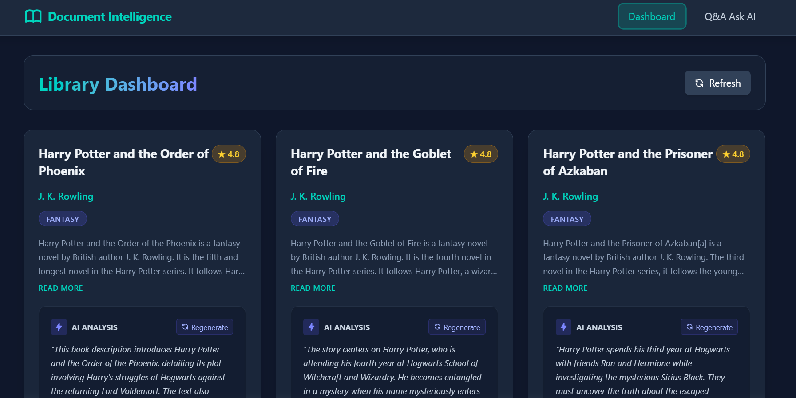
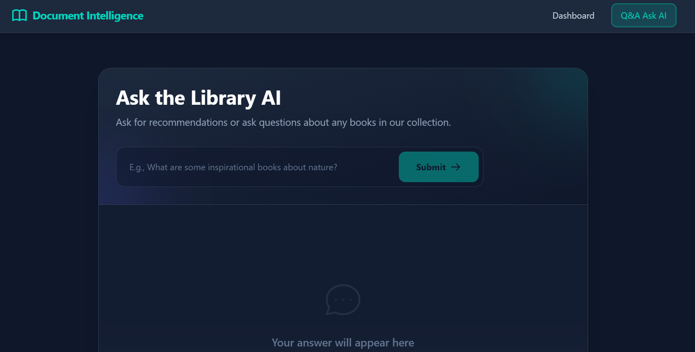
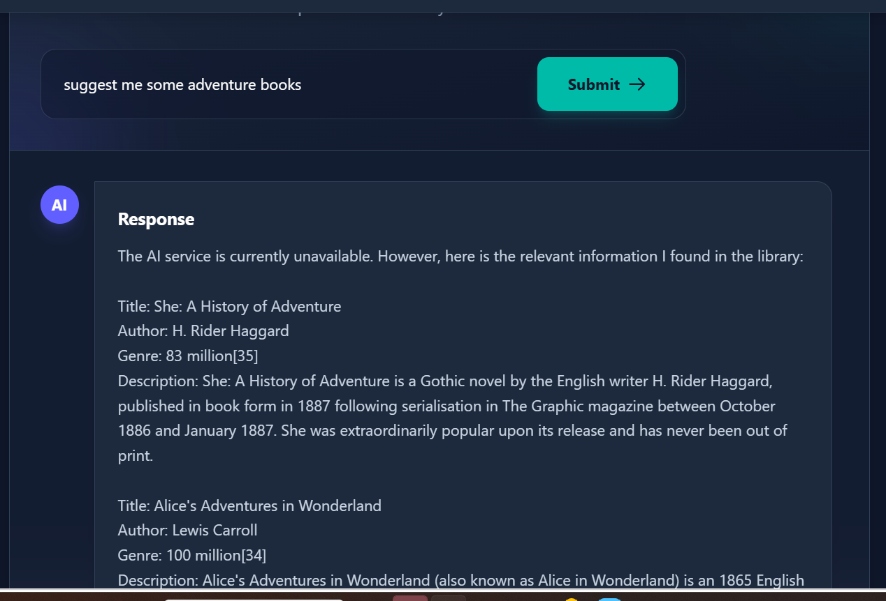

# Document Intelligence Platform

A full-stack web application with AI integration that processes book data and enables intelligent querying using RAG (Retrieval-Augmented Generation).

## Features
- **Backend**: Django REST Framework + SQLite + ChromaDB (Vector DB)
- **Frontend**: Vite + React + Tailwind CSS
- **Automation**: Data ingestion capabilities to fetch and parse external book data.
- **AI Integration**: LangChain + Local HuggingFace Embeddings + OpenAI/Local LLM for RAG Insights and semantic recommendations.

## Screenshots

Here are some glimpses of the Book Intelligence application's user interface:

### 1. Library Dashboard

*The main view displaying all books in the corpus with their associated AI generated insights and attributes.*

### 2. AI Question & Answer

*The dedicated Q&A portal allowing users to query their database utilizing a Retrieval Augmented Generation pipeline.*

### 3. RAG Query Execution

*System pulling contextual passages and passing to an LLM to recommend specifically tailored insights based on your query.*

*(Note: Please manually run `frontend/take_screenshots` or hit `Win+Shift+S` and save your screenshots into `frontend/public/assets/` to populate these!)*

## Setup Instructions

### 1. Backend Setup (Local Development)
1. Open a terminal in the `backend` directory.
2. Initialize your Python virtual environment: 
   - Windows: `python -m venv venv` and `.\venv\Scripts\activate`
   - Mac/Linux: `python3 -m venv venv` and `source venv/bin/activate`
3. Install dependencies: `pip install -r requirements.txt`.
4. Configure your Environment Variables: Create a `.env` file in the backend root directory.
   ```env
   # API KEY routing. Leave blank if using a local LM-Studio instance.
   OPENAI_API_KEY=your_key_here
   LLM_URL=http://localhost:1234/v1
   DEBUG=True
   ALLOWED_HOSTS=*
   ```
5. Run database migrations: `python manage.py migrate`.
6. Start the Django backend server: `python manage.py runserver`.

### 2. Frontend Setup (Local Development)
1. Open a terminal in the `frontend` directory.
2. Install NodeJS dependencies: `npm install`.
3. Start the Vite development server: `npm run dev`.
4. Your application will be live at `http://localhost:5173`.

### 3. Deployment
Refer to `deployment_guide.md` for specific instructions on pushing the frontend to **Vercel** and the backend to **Render**, mapping environment variables securely, and using `gunicorn`.

## Dependencies (`requirements.txt`)
All necessary backend packages are recorded in `backend/requirements.txt`:
```txt
django
djangorestframework
django-cors-headers
selenium
beautifulsoup4
chromadb
sentence-transformers
requests
openai
mysqlclient
gunicorn
whitenoise
python-dotenv
```

## API Documentation

### 1. Retrieve Library
- **Endpoint**: `GET /api/books/`
- **Description**: Returns a paginated list of all ingested books along with their generated AI insights, context summaries, and sentiments.

### 2. Ingest New Document / Book
- **Endpoint**: `POST /api/books/upload/`
- **Description**: Ingests new books into the ChromaDB vector database while predicting genre/sentiment using the LLM.
- **Payload Example**:
  ```json
  {
    "title": "Dune",
    "author": "Frank Herbert",
    "description": "Set on the desert planet Arrakis, Dune is the story of the boy Paul Atreides...",
    "url": "https://example.com/dune",
    "rating": 4.8
  }
  ```

### 3. Ask RAG Query
- **Endpoint**: `POST /api/books/ask/`
- **Description**: Embeds the user query, compares distance against `ChromaDB`, and forwards matched chunks to an LLM instruction prompt to answer questions.
- **Payload Example**:
  ```json
  {
    "query": "Are there any books about ecology and desert planets?"
  }
  ```

## Testing Samples

You can test the RAG flow instantly by running these `curl` commands (ensure your backend is live at 127.0.0.1:8000):

**Test 1: Check if the AI generates valid structured insights when adding a book:**
```bash
curl -X POST http://127.0.0.1:8000/api/books/upload/ \
     -H "Content-Type: application/json" \
     -d '{"title": "The Martian", "author": "Andy Weir", "description": "Six days ago, astronaut Mark Watney became one of the first people to walk on Mars. Now, he's sure he'll be the first person to die there."}'
```
*Expected Result:* The book is added, pushed to ChromaDB, and a JSON object containing tone (`tense`) and genre (`scifi`) is generated.

**Test 2: Retrieving an answer via the RAG API:**
```bash
curl -X POST http://127.0.0.1:8000/api/books/ask/ \
     -H "Content-Type: application/json" \
     -d '{"query": "Is there a book about an astronaut stranded on Mars?"}'
```
*Expected Result:* Contextual retrieval matches "The Martian" chunk, answering the user question while appending `sources: ["The Martian"]`.

## Sample Questions & Answers
Here are some sample AI resolutions achievable when testing:

* **Q**: What are some adventure books?
* **A**: Based on our library context, "A History of Adventure" by  H. Rider Haggard is a science fiction book . Additionally, "Alice's Adventures in Wonderland" by Lewis Carroll focuses on sci-fi themes.
* **Q**: Tell me some harry potter books.
* **A**: The book "Harry Potter and the Philosopher's Stonew" is a harry potter book.
